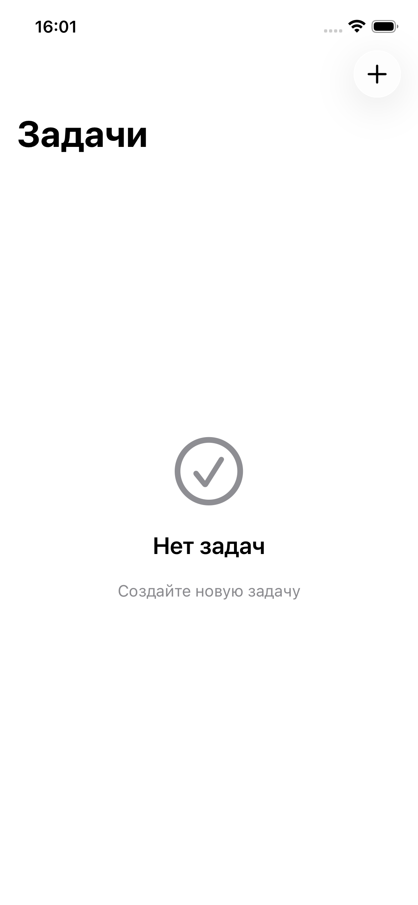
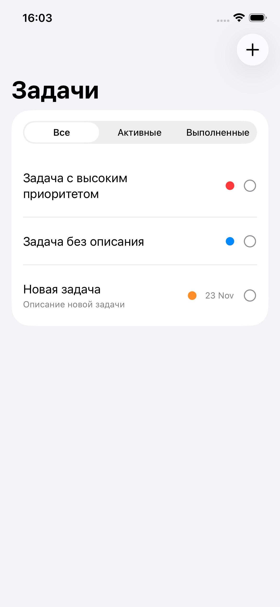
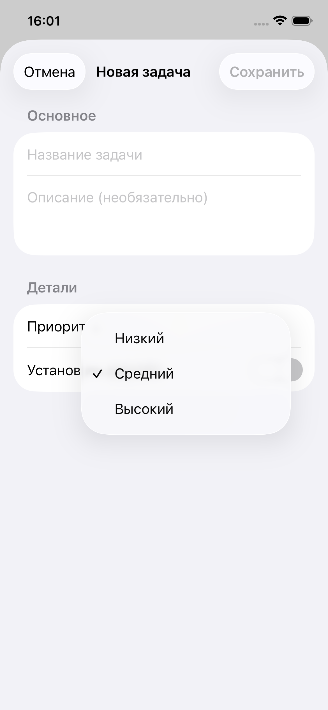
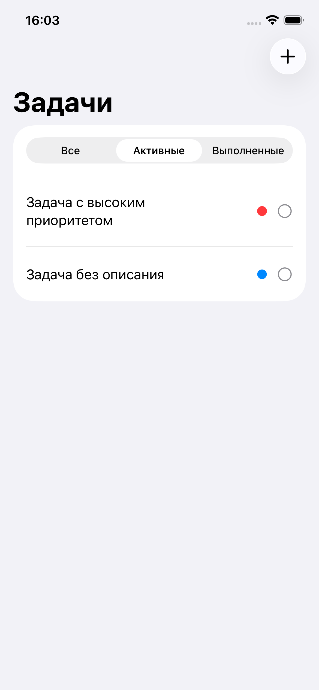
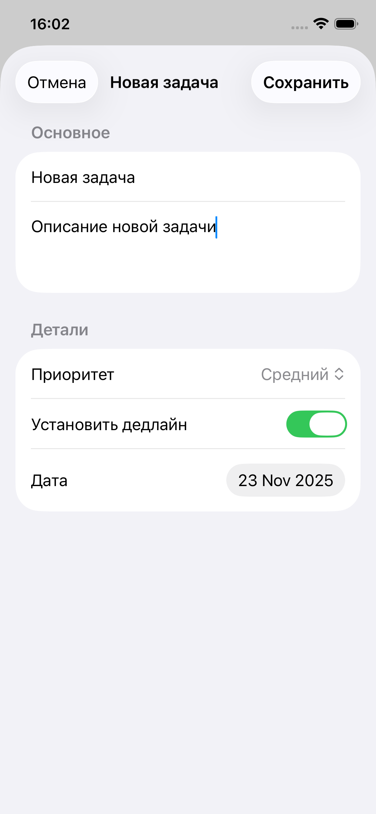
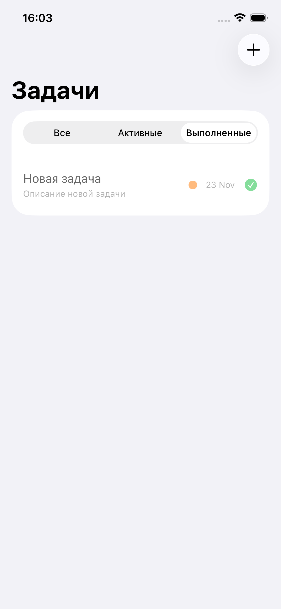

# TaskCom 

A minimalist task tracker with priorities and filters, inspired by Things 3.


🇷🇺 [Russian version](readme-ru.md)

## Screenshots
<p align="center">
  
  
  
  
  
  
  
</p>

| Task List | Add Task | Filters |
|:---------:|:--------:|:-------:|
|  |  |  |

## Features

- ✅ Create, edit, and delete tasks
- 🎯 Priority levels (Low / Medium / High)
- 📅 Optional deadlines with smart formatting ("Today", "Tomorrow")
- 🔍 Filter tasks (All / Active / Completed)
- 📊 Sort by date, priority, or title
- 💾 Persistent storage with CoreData
- 🎨 Clean, native iOS design

## Tech Stack

| Layer | Technology |
|-------|------------|
| UI | SwiftUI |
| Architecture | MVVM |
| Persistence | CoreData |
| Minimum iOS | 26.0 |

## Project Structure

```
TaskCom/
├── App/
│   └── TaskComApp.swift
├── Models/
│   ├── Task.swift
│   └── TaskCom.xcdatamodeld
├── ViewModels/
│   └── TaskListViewModel.swift
├── Views/
│   ├── TaskListView.swift
│   ├── TaskRowView.swift
│   ├── AddTaskView.swift
│   └── EmptyStateView.swift
└── Services/
    └── CoreDataManager.swift
```

## Architecture

```
View ← ViewModel ← CoreDataManager ← CoreData
         ↓
    Task (struct)
```

- **View**: SwiftUI components, UI logic only
- **ViewModel**: Business logic, filtering, sorting
- **CoreDataManager**: Singleton, handles persistence
- **Task**: Clean Swift struct, decoupled from CoreData

## Installation

1. Clone the repository
```bash
git clone https://github.com/OSITB/TaskCom.git
```

2. Open in Xcode
```bash
cd TaskCom
open TaskCom.xcodeproj
```

3. Build and run (⌘+R)

## What I Learned

This project helped me understand:

- **MVVM Architecture** — separation of concerns between View, ViewModel, and Model
- **CoreData** — persistent storage, entity relationships, fetch requests
- **SwiftUI Reactivity** — @Published, ObservableObject, @StateObject vs @ObservedObject
- **Defensive Programming** — handling optionals, graceful error handling
- **Dependency Isolation** — keeping CoreData details hidden from ViewModel
- **UX Patterns** — empty states, form validation, unsaved changes protection

## Future Improvements

- [ ] Categories/tags for tasks
- [ ] Search functionality
- [ ] Push notifications for deadlines
- [ ] Weekly statistics
- [ ] Widget support

## License

MIT License — feel free to use this project for learning!

---

*Built as a learning project to practice iOS development fundamentals.*
